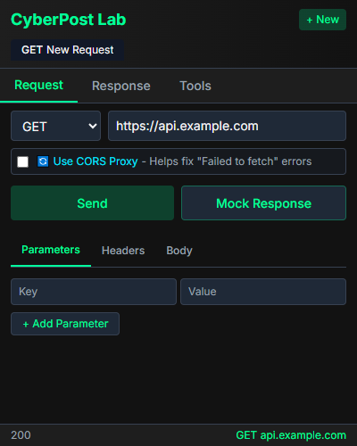
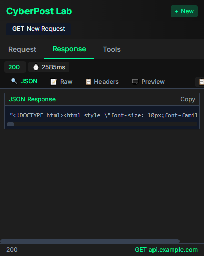

<h1 style="color:#2ecc71;"> CyberPost Lab Professional Edition</h1>

<em>The ultimate HTTP request laboratory for cybersecurity researchers and developers</em>

## Tool Overview

CyberPost Lab is a powerful browser extension specifically designed for cybersecurity professionals and developers. Create, modify, and test complex HTTP requests in a secure offline environment with an intuitive and feature-rich interface.

  
  

##  Key Features

<h3 style="color:#2ecc71;">🚀 Advanced Request Builder</h3>
<ul>
<li>Support for all HTTP methods (GET, POST, PUT, DELETE, etc.)</li>
<li>Custom headers and parameters</li>
<li>Raw and form-data request body options</li>
<li>JSON, XML, and plain text formatting</li>
</ul>

<h3 style="color:#e74c3c;">🔒 Security Toolkit</h3>
<ul>
<li>Built-in encryption/decryption utilities</li>
<li>Hash generation and verification</li>
<li>Base64 and URL encoding/decoding</li>
<li>Secure offline operation</li>
</ul>

<h3 style="color:#2ecc71;">📊 Response Analysis</h3>
<ul>
<li>Detailed status and timing information</li>
<li>Syntax-highlighted response viewer</li>
<li>Headers and cookies inspection</li>
<li>Response history tracking</li>
</ul>

<h3 style="color:#e74c3c;">⚡ Productivity Tools</h3>
<ul>
<li>Multi-tab workspace</li>
<li>Request templates and collections</li>
<li>Environment variables</li>
<li>Request history and favorites</li>
</ul>

## 📥 Installation

<h3>Chrome Installation</h3>
<ol>
<li>Download <a href="https://github.com/lfillaz/cyberpost/releases/latest/download/CyberPost-Chrome-Secure.zip" style="color:#e74c3c;font-weight:bold;">CyberPost for Chrome</a></li>
<li>Navigate to <code>chrome://extensions/</code></li>
<li>Enable "Developer Mode" in the top-right corner</li>
<li>Click "Load unpacked" and select the extracted folder</li>
</ol>

<strong style="color:#e74c3c;">Coming Soon</strong>: CyberPost will be available on the Chrome Web Store!

<h3>Firefox Installation</h3>
<ol>
<li>Download <a href="https://github.com/lfillaz/cyberpost/releases/latest/download/CyberPost-Firefox-Secure.zip" style="color:#2ecc71;font-weight:bold;">CyberPost for Firefox</a></li>
<li>Navigate to <code>about:debugging#/runtime/this-firefox</code></li>
<li>Click "Load Temporary Add-on..."</li>
<li>Select the manifest.json file from the extracted folder</li>
</ol>

<strong style="color:#2ecc71;">CyberPost available on Firefox Add-ons Store!
https://addons.mozilla.org/en-US/firefox/addon/cyberpost-lab/

<h3>Official Resources</h3>
<ul>
<li><strong>Official Website</strong>: <a href="https://www.byt.lol/" style="color:#3498db;font-weight:bold;">https://www.byt.lol/</a></li>
<li><strong>Privacy Policy</strong>: <a href="https://www.byt.lol/privacy.html" style="color:#3498db;font-weight:bold;">https://www.byt.lol/privacy.html</a></li>
</ul>

## 📜 Terms of Use

<h3 style="color:#e74c3c;">Important Notice</h3>
<ul>
<li>Use for legal and ethical purposes only</li>
<li>Do not use for unauthorized access to systems</li>
<li>User is responsible for compliance with applicable laws</li>
<li>Do not attempt to reverse engineer or modify the extension</li>
<li>Licensed for use until December 31, 2030</li>
</ul>

## 🌐 Community

Join our community of cybersecurity professionals and developers to share tips, report issues, and collaborate on new features.

## 👨‍💻 Development Team

  

    
    <h3 style="color:#2ecc71;">@lfillaz</h3>
    
Project Lead + Backend Developer + frontend Developer

    
  

  

    
    <h3 style="color:#2ecc71;">@RedPwnx</h3>
    
Security Researcher

    
  

  

    
    <h3 style="color:#2ecc71;">@0xwanted</h3>
    
Research Assistant Interface Developer

    
  

  
  <h3 style="color:#e74c3c;">Team Ghostbyte</h3>
  
Official development and security research team

  

## 📧 Contact & Support

- **Email Support**: fbi@asia.com
- **Issues & Feature Requests**: [GitHub Issues](https://github.com/lfillaz/cyberpost/issues)

<h3 style="color:#f1c40f;">💳 Support This Project</h3>

CyberPost is <strong style="color:#2ecc71;">100% FREE</strong> for the cybersecurity community.

If you find this tool helpful, please consider supporting our work through cryptocurrency donations:

<a href="https://nowpayments.io/donation?api_key=9R33NDQ-WYAMMZJ-KKD7R7W-D5CH3R1" style="display:inline-block;background-color:#f1c40f;color:#1e272e;padding:10px 20px;border-radius:5px;text-decoration:none;font-weight:bold;margin:10px 0;">💸 DONATE CRYPTO</a>

Your support helps us continue development and keep CyberPost free for everyone!

© 2025 Ghostbyte® - All rights reserved

Made with ❤️ for the cybersecurity community

